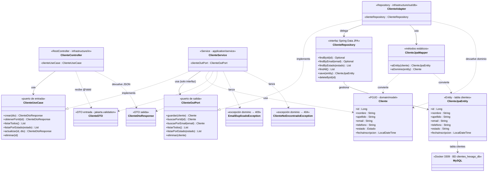
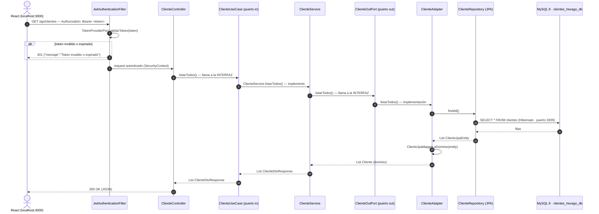

# 🏛️ Arquitectura — Mapa de clases (entidad CLIENTE)

Backend: `clientes-backend-hexagonal-ia` · Java 21 · Spring Boot 4.1.1 · **Arquitectura Hexagonal (Puertos y Adaptadores)**

> **Alcance**: este mapa documenta **solo la entidad Cliente** (el flujo de Usuario/Auth queda fuera para simplificar). Muestra **qué clase implementa qué interfaz** y hacia dónde apuntan las dependencias. Regla de oro (DIP): la capa interna **define** el puerto, la externa lo **implementa**.

---

## 1. Mapa ASCII por capas

```text
┌──────────────────────────────────────────────────────────────────────┐
│                    INFRASTRUCTURE  (adaptadores)                     │
│                                                                      │
│   ENTRADA (driving)                    SALIDA (driven)               │
│                                                                      │
│   in/                                  out/db/                       │
│    ├ ClienteController ─────────────┐    ├ ClienteJpaEntity (@Entity)  │
│    │  (@RestController)            │    │   tabla "clientes"          │
│    │  inyecta ▼ ClienteUseCase      │    ├ ClienteRepository           │
│    └ GlobalExceptionHandler        │    │  (Spring Data JPA)         │
│       mapea excepciones de dominio │    ├ ClienteAdapter              │
│         400 / 404 / 409            │    │  (@Repository)             │
│                                    │    │  implements ▼ ClienteOutPort│
│   security/ (protege /api/clientes) │    │  delega ▼ ClienteRepository │
│    ├ JwtAuthenticationFilter       │    └──────────┬─────────────────┘
│    │   Bearer → SecurityContext    │               │
│    └ SecurityConfig                │    mapper/    ▼
│        STATELESS · CSRF off        │    ┌ ClienteJpaMapper ──────────┼─► MySQL 8
│        CORS localhost:3000         │    │   Cliente ↔ ClienteJpaEntity│  (Docker 3309
└───────────────┬────────────────────┴───────────────┴────────────────┘  BD clientes_hexago_db
                │ puerto in (definido aquí)     ▲ puerto out (implementado aquí)
┌───────────────▼──────────────────────────────────────────────────────┐
│                 APPLICATION  (casos de uso)                          │
│                                                                      │
│   puerto IN:   ClienteUseCase  (interfaz)                             │
│   puerto OUT:  ClienteOutPort  (interfaz)                             │
│                                                                      │
│   service:     ClienteService ── implements ▶ ClienteUseCase           │
│                  inyecta ▶ ClienteOutPort (solo interfaces)           │
│                                                                      │
│   dto:         ClienteDTO (entrada)   ·   ClienteDtoResponse (salida)  │
└──────────────────────────────┬───────────────────────────────────────┘
                               │
┌──────────────────────────────▼───────────────────────────────────────┐
│                 DOMAIN  (núcleo de negocio, JAVA PURO)               │
│                                                                      │
│   model/       Cliente (POJO) · enum Cliente.Estado {ACTIVO, INACTIVO} │
│   exception/   EmailDuplicadoException      → HTTP 409               │
│                ClienteNoEncontradoException  → HTTP 404               │
│                                                                      │
│   Sin JPA, sin Spring, sin Lombok: cero dependencias.                │
└──────────────────────────────────────────────────────────────────────┘
```

---

## 2. Quién implementa qué (solo Cliente)

| Clase | Capa | Estereotipo | Implementa / Extiende | Inyecta / Usa |
|---|---|---|---|---|
| `ClienteController` | infrastructure/in | `@RestController` | — | **`ClienteUseCase`** (puerto in) · recibe `ClienteDTO` · devuelve `ClienteDtoResponse` |
| `ClienteService` | application/service | `@Service` | **implements `ClienteUseCase`** | **`ClienteOutPort`** (puerto out, solo interfaz) · lanza `EmailDuplicadoException` / `ClienteNoEncontradoException` |
| `ClienteAdapter` | infrastructure/out/db | `@Repository` | **implements `ClienteOutPort`** | `ClienteRepository` · `ClienteJpaMapper` |
| `ClienteRepository` | infrastructure/out/db | interfaz Spring Data | **extends `JpaRepository<ClienteJpaEntity, Long>`** | gestiona `ClienteJpaEntity` |
| `ClienteJpaEntity` | infrastructure/out/db | `@Entity` (tabla `clientes`, email único) | — | — |
| `ClienteJpaMapper` | infrastructure/mapper | métodos estáticos | — | convierte `Cliente` (dominio) ↔ `ClienteJpaEntity` (JPA) |
| `Cliente` | domain/model | POJO puro | — | — (usado por `ClienteService` y `ClienteAdapter`) |
| `ClienteDTO` / `ClienteDtoResponse` | application/dto | DTO entrada / salida | — | atraviesan el puerto in (nunca la entidad de dominio) |
| `GlobalExceptionHandler` | infrastructure/in | `@RestControllerAdvice` | — | mapea `EmailDuplicadoException`→409, `ClienteNoEncontradoException`→404, `MethodArgumentNotValidException`→400 |
| `JwtAuthenticationFilter` | infrastructure/security | `OncePerRequestFilter` | — | valida `Bearer` para las rutas de clientes (inválido→401, sin token→403) |
| `SecurityConfig` | infrastructure/security | `@Configuration` | — | define la `SecurityFilterChain` (rutas públicas vs `/api/clientes/**` protegidas) |

---

## 3. Diagrama de clases (Mermaid — renderiza en GitHub / VS Code)



---

## 4. Flujo de un request autenticado (Mermaid — secuencia)



> Si el cliente no existe (GET/{id}), `ClienteService` lanza `ClienteNoEncontradoException` y `GlobalExceptionHandler` responde **404**; si el email está duplicado (POST/PUT), lanza `EmailDuplicadoException` → **409**; si fallan las validaciones del DTO (`@Valid`), responde **400**.

---

## 5. 📋 PROMPT del mapa (copiar y pegar para regenerar el gráfico)

```text
Actuá como generador de diagramas de arquitectura de software.

Generá un diagrama de ARQUITECTURA HEXAGONAL (Puertos y Adaptadores) para el
módulo CLIENTE de un backend Java 21 + Spring Boot 4.1.1 con MySQL 8 en Docker
(puerto 3309, BD clientes_hexago_db). SOLO la entidad Cliente. Todo en español.

CAPAS Y CLASES
1) DOMAIN (núcleo puro, sin JPA/Spring/Lombok):
   - Cliente (POJO): id, nombre, apellido, email único, telefono, estado
     (ACTIVO/INACTIVO), fechaInscripcion.
   - EmailDuplicadoException (→ HTTP 409) y ClienteNoEncontradoException (→ HTTP 404).

2) APPLICATION (casos de uso; solo conoce domain y sus puertos):
   - Puerto de ENTRADA ClienteUseCase (interfaz): crear, obtenerPorId,
     listarTodos, listarPorEstado, actualizar, eliminar. Firma con DTOs.
   - Puerto de SALIDA ClienteOutPort (interfaz): guardar, buscarPorId,
     buscarPorEmail, listarTodos, listarPorEstado, eliminar. Firma con el dominio.
   - ClienteService (@Service) implements ClienteUseCase; inyecta SOLO la
     interfaz ClienteOutPort; usa ClienteDTO (entrada) y ClienteDtoResponse (salida).

3) INFRASTRUCTURE (adaptadores; única capa con JPA/Web/Security):
   - ENTRADA: ClienteController (@RestController) inyecta ClienteUseCase y expone
     /api/clientes (GET, GET/{id}, GET/estado/{estado}, POST, PUT/{id}, DELETE/{id});
     GlobalExceptionHandler (@RestControllerAdvice) mapea excepciones de dominio
     a 400/404/409.
   - SEGURIDAD: JwtAuthenticationFilter (valida Bearer; token inválido → 401,
     sin token → 403) y SecurityConfig (stateless, CSRF off, CORS
     http://localhost:3000, rutas /api/clientes/** protegidas).
   - SALIDA: ClienteAdapter (@Repository) implements ClienteOutPort, delega en
     ClienteRepository (Spring Data JPA, extends JpaRepository<ClienteJpaEntity,
     Long>) y usa ClienteJpaMapper para convertir Cliente ↔ ClienteJpaEntity
     (@Entity, tabla "clientes").

RELACIONES A DIBUJAR
   - ClienteController  --usa-->        ClienteUseCase
   - ClienteService     --implements--> ClienteUseCase
   - ClienteService     --usa-->        ClienteOutPort
   - ClienteAdapter     --implements--> ClienteOutPort
   - ClienteAdapter     --delega-->     ClienteRepository
   - ClienteRepository  --gestiona-->   ClienteJpaEntity
   - ClienteJpaEntity   -->             MySQL (tabla clientes)
   - ClienteJpaMapper   convierte       Cliente ↔ ClienteJpaEntity
   - ClienteService     lanza           EmailDuplicadoException (409) /
                                       ClienteNoEncontradoException (404)

DIRECCIÓN DE DEPENDENCIAS (DIP)
   - infrastructure apunta hacia application y domain (nunca al revés).
   - application define ClienteOutPort; infrastructure (ClienteAdapter) lo implementa.
   - domain no depende de nada.

FORMATO DEL DIAGRAMA
   - En capas: infrastructure arriba, application al medio, domain abajo;
     los puertos in/out en el borde del hexágono.
   - Flechas de "implements" con estilo distinto a las de "usa/delega".
   - Incluir el flujo de un request autenticado:
     React (Bearer token) → JwtAuthenticationFilter → ClienteController →
     ClienteUseCase → ClienteService → ClienteOutPort → ClienteAdapter →
     ClienteRepository → ClienteJpaEntity → MySQL → 200 con ClienteDtoResponse.
```

> **Cómo usarlo**: pegá el prompt en cualquier generador de diagramas (IA, draw.io, etc.), o usá directamente los bloques ```mermaid de las secciones 3 y 4 (GitHub, VS Code y [mermaid.live](https://mermaid.live) los renderizan tal cual).

---

## 6. Notas rápidas

- **Inversión de dependencias**: `ClienteService` nunca ve a `ClienteAdapter`; ambos hablan por la interfaz `ClienteOutPort`. Cambiar MySQL por Postgres solo tocaría `infrastructure/out/db/`.
- **La entidad JPA nunca sale**: el controller recibe `ClienteDTO` y devuelve `ClienteDtoResponse`; la conversión dominio↔JPA vive solo en `ClienteJpaMapper`.
- **Errores de dominio → HTTP**: `GlobalExceptionHandler` traduce `EmailDuplicadoException`→409 y `ClienteNoEncontradoException`→404 sin que el dominio sepa que existe HTTP.


