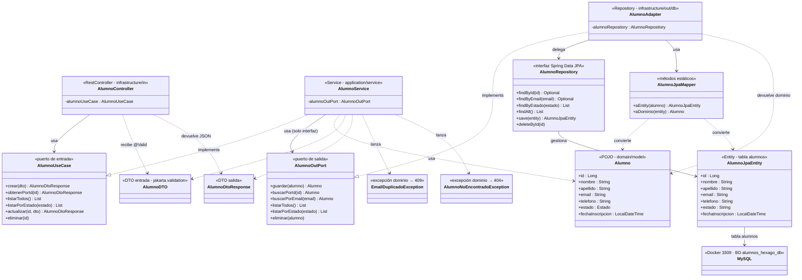
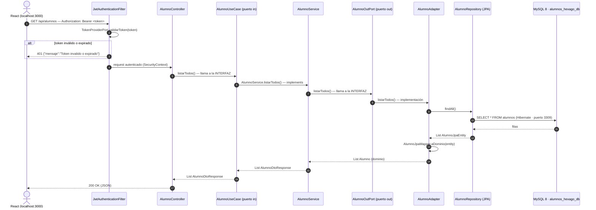

# 🏛️ Arquitectura — Mapa de clases (entidad ALUMNO)

Backend: `alumnos-backend-hexagonal-ia` · Java 21 · Spring Boot 4.1.1 · **Arquitectura Hexagonal (Puertos y Adaptadores)**

> **Alcance**: este mapa documenta **solo la entidad Alumno** (el flujo de Usuario/Auth queda fuera para simplificar). Muestra **qué clase implementa qué interfaz** y hacia dónde apuntan las dependencias. Regla de oro (DIP): la capa interna **define** el puerto, la externa lo **implementa**.

---

## 1. Mapa ASCII por capas

```text
┌──────────────────────────────────────────────────────────────────────┐
│                    INFRASTRUCTURE  (adaptadores)                     │
│                                                                      │
│   ENTRADA (driving)                    SALIDA (driven)               │
│                                                                      │
│   in/                                  out/db/                       │
│    ├ AlumnoController ─────────────┐    ├ AlumnoJpaEntity (@Entity)  │
│    │  (@RestController)            │    │   tabla "alumnos"          │
│    │  inyecta ▼ AlumnoUseCase      │    ├ AlumnoRepository           │
│    └ GlobalExceptionHandler        │    │  (Spring Data JPA)         │
│       mapea excepciones de dominio │    ├ AlumnoAdapter              │
│         400 / 404 / 409            │    │  (@Repository)             │
│                                    │    │  implements ▼ AlumnoOutPort│
│   security/ (protege /api/alumnos) │    │  delega ▼ AlumnoRepository │
│    ├ JwtAuthenticationFilter       │    └──────────┬─────────────────┘
│    │   Bearer → SecurityContext    │               │
│    └ SecurityConfig                │    mapper/    ▼
│        STATELESS · CSRF off        │    ┌ AlumnoJpaMapper ──────────┼─► MySQL 8
│        CORS localhost:3000         │    │   Alumno ↔ AlumnoJpaEntity│  (Docker 3309
└───────────────┬────────────────────┴───────────────┴────────────────┘  BD alumnos_hexago_db
                │ puerto in (definido aquí)     ▲ puerto out (implementado aquí)
┌───────────────▼──────────────────────────────────────────────────────┐
│                 APPLICATION  (casos de uso)                          │
│                                                                      │
│   puerto IN:   AlumnoUseCase  (interfaz)                             │
│   puerto OUT:  AlumnoOutPort  (interfaz)                             │
│                                                                      │
│   service:     AlumnoService ── implements ▶ AlumnoUseCase           │
│                  inyecta ▶ AlumnoOutPort (solo interfaces)           │
│                                                                      │
│   dto:         AlumnoDTO (entrada)   ·   AlumnoDtoResponse (salida)  │
└──────────────────────────────┬───────────────────────────────────────┘
                               │
┌──────────────────────────────▼───────────────────────────────────────┐
│                 DOMAIN  (núcleo de negocio, JAVA PURO)               │
│                                                                      │
│   model/       Alumno (POJO) · enum Alumno.Estado {ACTIVO, INACTIVO} │
│   exception/   EmailDuplicadoException      → HTTP 409               │
│                AlumnoNoEncontradoException  → HTTP 404               │
│                                                                      │
│   Sin JPA, sin Spring, sin Lombok: cero dependencias.                │
└──────────────────────────────────────────────────────────────────────┘
```

---

## 2. Quién implementa qué (solo Alumno)

| Clase | Capa | Estereotipo | Implementa / Extiende | Inyecta / Usa |
|---|---|---|---|---|
| `AlumnoController` | infrastructure/in | `@RestController` | — | **`AlumnoUseCase`** (puerto in) · recibe `AlumnoDTO` · devuelve `AlumnoDtoResponse` |
| `AlumnoService` | application/service | `@Service` | **implements `AlumnoUseCase`** | **`AlumnoOutPort`** (puerto out, solo interfaz) · lanza `EmailDuplicadoException` / `AlumnoNoEncontradoException` |
| `AlumnoAdapter` | infrastructure/out/db | `@Repository` | **implements `AlumnoOutPort`** | `AlumnoRepository` · `AlumnoJpaMapper` |
| `AlumnoRepository` | infrastructure/out/db | interfaz Spring Data | **extends `JpaRepository<AlumnoJpaEntity, Long>`** | gestiona `AlumnoJpaEntity` |
| `AlumnoJpaEntity` | infrastructure/out/db | `@Entity` (tabla `alumnos`, email único) | — | — |
| `AlumnoJpaMapper` | infrastructure/mapper | métodos estáticos | — | convierte `Alumno` (dominio) ↔ `AlumnoJpaEntity` (JPA) |
| `Alumno` | domain/model | POJO puro | — | — (usado por `AlumnoService` y `AlumnoAdapter`) |
| `AlumnoDTO` / `AlumnoDtoResponse` | application/dto | DTO entrada / salida | — | atraviesan el puerto in (nunca la entidad de dominio) |
| `GlobalExceptionHandler` | infrastructure/in | `@RestControllerAdvice` | — | mapea `EmailDuplicadoException`→409, `AlumnoNoEncontradoException`→404, `MethodArgumentNotValidException`→400 |
| `JwtAuthenticationFilter` | infrastructure/security | `OncePerRequestFilter` | — | valida `Bearer` para las rutas de alumnos (inválido→401, sin token→403) |
| `SecurityConfig` | infrastructure/security | `@Configuration` | — | define la `SecurityFilterChain` (rutas públicas vs `/api/alumnos/**` protegidas) |

---

## 3. Diagrama de clases (Mermaid — renderiza en GitHub / VS Code)



---

## 4. Flujo de un request autenticado (Mermaid — secuencia)



> Si el alumno no existe (GET/{id}), `AlumnoService` lanza `AlumnoNoEncontradoException` y `GlobalExceptionHandler` responde **404**; si el email está duplicado (POST/PUT), lanza `EmailDuplicadoException` → **409**; si fallan las validaciones del DTO (`@Valid`), responde **400**.

---

## 5. 📋 PROMPT del mapa (copiar y pegar para regenerar el gráfico)

```text
Actuá como generador de diagramas de arquitectura de software.

Generá un diagrama de ARQUITECTURA HEXAGONAL (Puertos y Adaptadores) para el
módulo ALUMNO de un backend Java 21 + Spring Boot 4.1.1 con MySQL 8 en Docker
(puerto 3309, BD alumnos_hexago_db). SOLO la entidad Alumno. Todo en español.

CAPAS Y CLASES
1) DOMAIN (núcleo puro, sin JPA/Spring/Lombok):
   - Alumno (POJO): id, nombre, apellido, email único, telefono, estado
     (ACTIVO/INACTIVO), fechaInscripcion.
   - EmailDuplicadoException (→ HTTP 409) y AlumnoNoEncontradoException (→ HTTP 404).

2) APPLICATION (casos de uso; solo conoce domain y sus puertos):
   - Puerto de ENTRADA AlumnoUseCase (interfaz): crear, obtenerPorId,
     listarTodos, listarPorEstado, actualizar, eliminar. Firma con DTOs.
   - Puerto de SALIDA AlumnoOutPort (interfaz): guardar, buscarPorId,
     buscarPorEmail, listarTodos, listarPorEstado, eliminar. Firma con el dominio.
   - AlumnoService (@Service) implements AlumnoUseCase; inyecta SOLO la
     interfaz AlumnoOutPort; usa AlumnoDTO (entrada) y AlumnoDtoResponse (salida).

3) INFRASTRUCTURE (adaptadores; única capa con JPA/Web/Security):
   - ENTRADA: AlumnoController (@RestController) inyecta AlumnoUseCase y expone
     /api/alumnos (GET, GET/{id}, GET/estado/{estado}, POST, PUT/{id}, DELETE/{id});
     GlobalExceptionHandler (@RestControllerAdvice) mapea excepciones de dominio
     a 400/404/409.
   - SEGURIDAD: JwtAuthenticationFilter (valida Bearer; token inválido → 401,
     sin token → 403) y SecurityConfig (stateless, CSRF off, CORS
     http://localhost:3000, rutas /api/alumnos/** protegidas).
   - SALIDA: AlumnoAdapter (@Repository) implements AlumnoOutPort, delega en
     AlumnoRepository (Spring Data JPA, extends JpaRepository<AlumnoJpaEntity,
     Long>) y usa AlumnoJpaMapper para convertir Alumno ↔ AlumnoJpaEntity
     (@Entity, tabla "alumnos").

RELACIONES A DIBUJAR
   - AlumnoController  --usa-->        AlumnoUseCase
   - AlumnoService     --implements--> AlumnoUseCase
   - AlumnoService     --usa-->        AlumnoOutPort
   - AlumnoAdapter     --implements--> AlumnoOutPort
   - AlumnoAdapter     --delega-->     AlumnoRepository
   - AlumnoRepository  --gestiona-->   AlumnoJpaEntity
   - AlumnoJpaEntity   -->             MySQL (tabla alumnos)
   - AlumnoJpaMapper   convierte       Alumno ↔ AlumnoJpaEntity
   - AlumnoService     lanza           EmailDuplicadoException (409) /
                                       AlumnoNoEncontradoException (404)

DIRECCIÓN DE DEPENDENCIAS (DIP)
   - infrastructure apunta hacia application y domain (nunca al revés).
   - application define AlumnoOutPort; infrastructure (AlumnoAdapter) lo implementa.
   - domain no depende de nada.

FORMATO DEL DIAGRAMA
   - En capas: infrastructure arriba, application al medio, domain abajo;
     los puertos in/out en el borde del hexágono.
   - Flechas de "implements" con estilo distinto a las de "usa/delega".
   - Incluir el flujo de un request autenticado:
     React (Bearer token) → JwtAuthenticationFilter → AlumnoController →
     AlumnoUseCase → AlumnoService → AlumnoOutPort → AlumnoAdapter →
     AlumnoRepository → AlumnoJpaEntity → MySQL → 200 con AlumnoDtoResponse.
```

> **Cómo usarlo**: pegá el prompt en cualquier generador de diagramas (IA, draw.io, etc.), o usá directamente los bloques ```mermaid de las secciones 3 y 4 (GitHub, VS Code y [mermaid.live](https://mermaid.live) los renderizan tal cual).

---

## 6. Notas rápidas

- **Inversión de dependencias**: `AlumnoService` nunca ve a `AlumnoAdapter`; ambos hablan por la interfaz `AlumnoOutPort`. Cambiar MySQL por Postgres solo tocaría `infrastructure/out/db/`.
- **La entidad JPA nunca sale**: el controller recibe `AlumnoDTO` y devuelve `AlumnoDtoResponse`; la conversión dominio↔JPA vive solo en `AlumnoJpaMapper`.
- **Errores de dominio → HTTP**: `GlobalExceptionHandler` traduce `EmailDuplicadoException`→409 y `AlumnoNoEncontradoException`→404 sin que el dominio sepa que existe HTTP.


